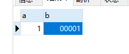
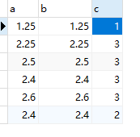
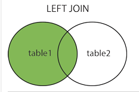
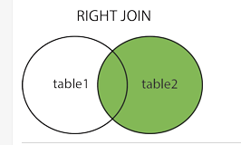
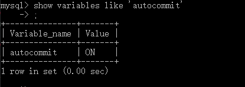
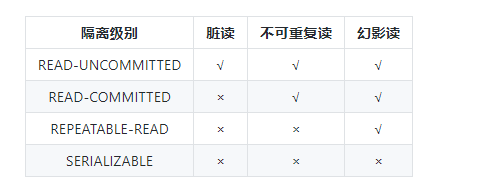

#### Mysql

##### mysql的数据类型

------

> mysql,存储数据也是有正负之分的，在mysql中，默认是有符号类型。

**UNSIGNED：无符号类型**

```mysql
 a int UNSIGNED #创建一个无符号整形字段的a  所以在插入数据的时候会报错误。 
 # Out of range value for column 'a' at row 1
```


**ZEROFILL： 补齐字段宽度到指定的宽度值，将有符号类型变为无符号类型**

> **int(n)  n表示的就是数据类型的宽度**

```mysql
a int(5) #设置宽度为5的整形字段a 当这样设置字段的时候，如果插入宽度小于5的值，这个宽度并没有起作用。
b int(5) ZEROFILL # 设置宽度为5的整形字段a 当插入宽度小于5的值时，会使用0补齐

#建表
create table test3(
	a int(5),
    b int(5) ZEROFILL
)
#插入数据
insert into test3 values(1,1)
insert into test3 values(1,-1) #出现错误 Out of range value for column 'b' at row 1
```




------

**浮点数**

> float ：单精度
>
> double ： 双精度
>
> decimal ：定点型

插入数据，数据的进位问题，**decimal   四舍五入**

**float double的数据进位  四舍六入五成双：五成双是指，查看小数点前一位是不是偶数，如果是偶数进位**

```mysql
#建表
create table test3(
	a FLOAT,
 	b DOUBLE,
	c DECIMAL
)
#插入数据
insert into test3 values(1.25,1.25,1.25)
insert into test3 values(2.5,2.5,2.5)
insert into test3 values(2.4,2.4,2.5)
insert into test3 values(2.6,2.6,2.6)
insert into test3 values(2.4,2.4,1.5)
```




------

##### DDL常见操作

> **DDL ：Data Define Language数据定义语言，就是对数据库、表的操作，如建库、删库、建表、删表、增删改查**

**字段的约束说明**

- **not null：表示该字段不能为空**
- **default value：设置默认值**
- **comment：字段注释**
- **primary key：主键约束**
- **foreign key：外键约束**
- **auto_increment：表示该字段自动增长**

```mysql
#查询
select * from 表名
#插入
insert into 表名(字段，字段) values(字段，字段)
#修改
update 表名 set 字段=值 where 条件
#删除
delete from 表名
```

------

##### DQL

> **Data Query Language ，数据查询语言**

**基础查询**

```mysql
#查询全表
select * from 表名
#查询列
select 列名称,列名称 from 表名
#列起别名
select 列名称 as 别名 from 表名
```

**条件查询**

条件在where后面

```mysql
= 、< 、> 、!=、<=、>=

and （表示所有条件都必须满足）

like （模糊查询）

or（表示所有条件中有一个满足就可以）

is null(为空)  is not null(不为空) 

between ........ and.....(表示从指定开始的值到结束的值，包含开始值和结束值)

in(set) 查找多个符合条件的内容。使用集合表示，多个值之间用逗号

not（set）查找多个不符合条件的内容。
```

`注意`：**对于null值查询，需要使用 is null 或者 is not null**

------

##### 排序和分页

> **排序查询 order by**

- **升序 asc，默认为升序**
- **降序 desc**

> **分页 limit**

**limit m,n  :  m表示偏移量，n表示查询的数据条数**

------

##### 分组，条件

>select 列 from  表名
>where [查询条件]
>group by [分组表达式]
>having [分组过滤条件]
>order by [排序条件]
>limit [offset,] count;

**group by 字段：按照该字段分组**

**having 条件 ：分组过滤的条件**

------

##### 连接查询

- **内连接**

  ```mysql
  #不带条件的内连接查询，相当于两个for循环，从t1表中一条数据开始于t2的每一条数据进行匹配
  select 字段 from t1 join t2
  #带条件的 on 条件
  select 字段 from t1 join t2 on 条件
  #带条件的 where  常使用的
  select 字段 from t1 , t2  where 条件
  ```

- **左连接 ： left join    on     left join 左边的是主表，展示主表的所有信息，然后加上从表于主表中有对应的信息**  

  

  ```mysql
  select 字段 from t1 left t2 on t1.字段 = t2.字段 
  ```

- **右连接： right join on    右边的是主表**

  

  ```mysql
  select 字段 from t1 right t2 on t1.字段 = t2.字段
  ```

  **在使用左右连接的时候，要确实哪个是主表**

------

##### 事务

> **什么是事务**
>
> 《MySQL技术内幕：InnoDB存储引擎》中是这么介绍的：在数据库提交工作时，可以确保要么所以修改都已经保存了，要么所以修改都不保存。

**数据库的事务，是对数据库执行一批操作（一组或者一条sql语句），这些操作要么全部成功，要么全部失败**


> **事务的特性  ACID**

- **原子性  Atomicity**

  ==原子性指的是，当前的操作要满足原子性，保证要么全部成功，要么全部失败。==

- **一致性 Consistency**

  ==事务在操作的过程中，数据是一致的==

- **隔离性 Isolation**

  ==事务的隔离性是指，每一个事务操作对象对其他事务的操作对象都是相互隔离的，在未提交之前，对其他事务都是不可见的。==

- **持久性 Durability**

  ==事务提交后，结果是持久性的==


**Mysql中的事务操作**

> 在mysql中事务的默认是隐式事务



**事务的控制语句**

```mysql
#第一种方式，设置autocommit
set autocommit = 0; # 禁止自动提交事务  
set autocommit = 1; # 开启自动提交

#第二种
begin #开启事务  // start transaction #开启事务
commit #提交事务
rollback #回滚事务


#保存点
savepoint 名称 #设置一个保存点
rollback to 名称  # 回滚到保存点

#设置事务级别
#级别： read uncommited | read commited | repeatable read | serializable
set transaction 级别  
```


**事务带来的问题**

- **脏读**

  ==一个事务在执行的过程中读取到了其他事务还没有提交的数据，读到了脏数据==

- **不可重复读**

  ==一个事务难道需要操作的数据，在并发的条件下，其他的事务对这条数据进行了修改，但是这个事务并不知道，出现了前后数据不一致，所以，这就要求在读取数据的时候，进行加锁的操作，防止这个问题的出现==

- **幻读**

  ==**事务a和事务b同时操作一张表，事务b提交的数据，不能被事务a读到，当事务a插入与事务b相同的数据时，就造成了幻读。**==


**事务的隔离级别**

- **读未提交  read uncommited**  
- **读已提交  read commited**
- **可重复读 repeatable read**
- **串行  serializable**




------

##### 存储过程

```mysql
#创建存储过程
create procedure  存储过程名称(参数)
begin
	存储过程体
end

#存储过程的调用
call 存储过程名称

#删除
drop procedure 存储过程名称

#存储过程不能修改

```

##### 索引

##### 锁

